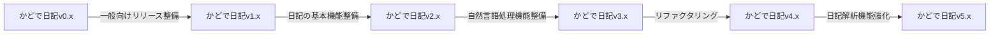
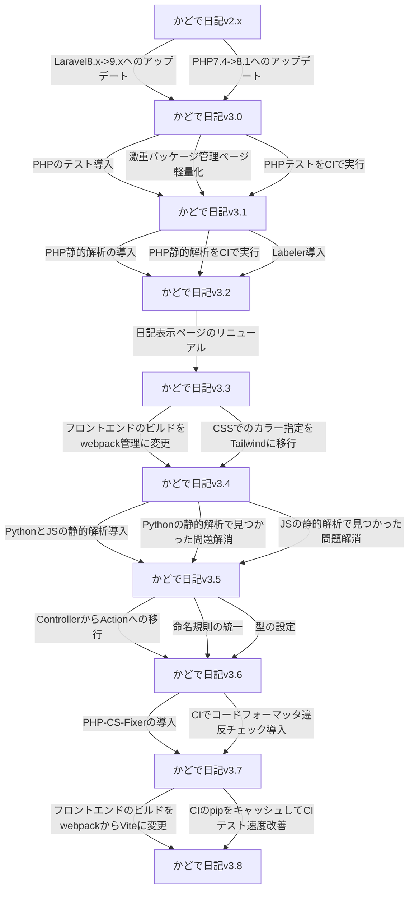
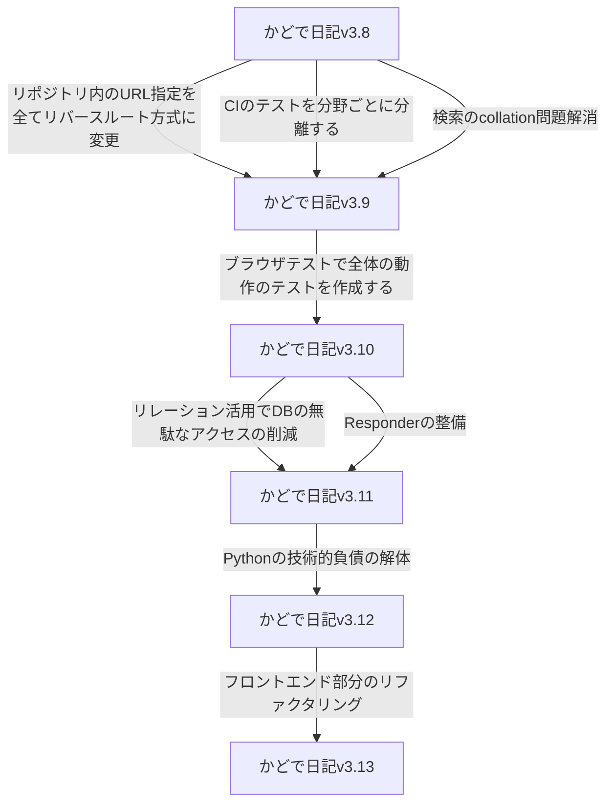
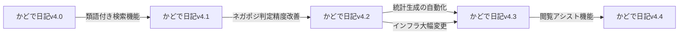

# この web アプリについて

個人的に欲しかった統計付き日記管理 web アプリを作っています。

https://kadode.usuyuki.net

# Operation

## CI
### テスト周り
[![PHPテスト[ブラウザ]](https://github.com/Usuyuki/kadode_nikki3/actions/workflows/BrowserTest.yml/badge.svg)](https://github.com/Usuyuki/kadode_nikki3/actions/workflows/BrowserTest.yml)
[![PHPテスト[結合]](https://github.com/Usuyuki/kadode_nikki3/actions/workflows/CombinedTest.yml/badge.svg)](https://github.com/Usuyuki/kadode_nikki3/actions/workflows/CombinedTest.yml)
[![PHPテスト[単体]](https://github.com/Usuyuki/kadode_nikki3/actions/workflows/unitTest.yml/badge.svg)](https://github.com/Usuyuki/kadode_nikki3/actions/workflows/unitTest.yml)
### コード解析

### 他

## Web

## Language

# 開発おたより

**現在はかどで日記v3系「リファクタリングのフェーズ」です!**

## 大域ロードマップ

※かどで日記3内でのバージョン。かどで日記、かどで日記2とは異なる

## v3系終了済みリファクタリング

## v3系未リファクタリング

## v4系ロードマップ

# 文章周り

## 開発者向けの情報は、かどで日記 wiki を御覧ください

[かどで日記 wiki](https://github.com/Usuyuki/kadode_nikki3/wiki)

## **ライセンス**

### かどで日記ライセンス

[LICENSE](./LICENSE.md)

    Copyright (c) 2021-2022 usuyuki

    Released under the MIT license

### 使用しているソフトウェアのライセンス表記

[usedLicense.md](./docs/99_usedLicense.md)

## 他

[プライバシーポリシー](https://kadode.usuyuki.net/privacyPolicy)

[利用規約](https://kadode.usuyuki.net/terms)

[このサイトについて](https://kadode.usuyuki.net/aboutThisSite)

[お問い合わせ](https://kadode.usuyuki.net/contact)

[お知らせ](https://kadode.usuyuki.net/osirase)

[リリースノート](https://kadode.usuyuki.net/releaseNote)

