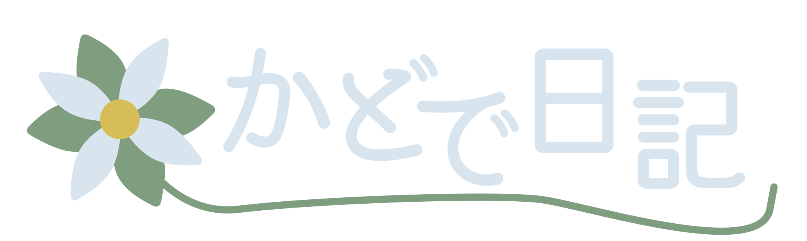

# この web アプリについて

かどで日記は日記を振り返りやすくすることを目指して開発しているサービスです。
その時その時の感情を綴った日記を振り返りやすくする機能を中心に開発を進めています。

https://kadode.usuyuki.net

# Operation

## CI

### バックエンド

[![【backend】テスト[単体]](https://github.com/KadodeProject/kadode_nikki3/actions/workflows/backend-testUnit.yml/badge.svg)](https://github.com/KadodeProject/kadode_nikki3/actions/workflows/backend-testUnit.yml)
[![【backend】テスト[結合]](https://github.com/KadodeProject/kadode_nikki3/actions/workflows/backend-testCombination.yml/badge.svg)](https://github.com/KadodeProject/kadode_nikki3/actions/workflows/backend-testCombination.yml)

### フロントエンド

[![【frontend】テスト[単体]](https://github.com/KadodeProject/kadode_nikki3/actions/workflows/frontend-testUnit.yml/badge.svg)](https://github.com/KadodeProject/kadode_nikki3/actions/workflows/frontend-testUnit.yml)
[![【frontend】テスト[結合(コンポーネント)]](https://github.com/KadodeProject/kadode_nikki3/actions/workflows/frontend-testCombination.yml/badge.svg)](https://github.com/KadodeProject/kadode_nikki3/actions/workflows/frontend-testCombination.yml)
[![【frontend】テスト[統合]](https://github.com/KadodeProject/kadode_nikki3/actions/workflows/frontend-testIntegration.yml/badge.svg)](https://github.com/KadodeProject/kadode_nikki3/actions/workflows/frontend-testIntegration.yml)

### NLP

[![【nlp】テスト[単体]](https://github.com/KadodeProject/kadode_nikki3/actions/workflows/nlp-testUnit.yml/badge.svg)](https://github.com/KadodeProject/kadode_nikki3/actions/workflows/nlp-testUnit.yml)
[![【nlp】テスト[結合]](https://github.com/KadodeProject/kadode_nikki3/actions/workflows/nlp-testCombination.yml/badge.svg)](https://github.com/KadodeProject/kadode_nikki3/actions/workflows/nlp-testCombination.yml)
[![【nlp】テスト[統合]](https://github.com/KadodeProject/kadode_nikki3/actions/workflows/nlp-testIntegration.yml/badge.svg)](https://github.com/KadodeProject/kadode_nikki3/actions/workflows/nlp-testIntegration.yml)

## CD

## 他

## Website

# 構成

## リポジトリの構成について

-   backend : かどで日記のバックエンド・フロントエンド(PHP)
-   docs : wiki.kado.day の中身
-   frontend : かどで日記フロントエンド SvelteKit 化をしているディレクトリ
-   frontend_discontinued : かどで日記フロントエンド Next.js 化作業中に断念されたディレクトリ(削除予定)
-   infra : かどで日記のインフラ周り(開発 Docker 本番 k8s で、本番向けのマニュフェストは別リポジトリで管理)
-   nlp : かどで日記自然言語処理部分(Python)
-   proto : かどで日記の Python と PHP で gRPC するための proto 置き場
-   sampleData : かどで日記のインポート機能の検証で使うためのサンプルデータ
-   script : 開発用のちょっとしたスクリプト置き場

## フロントエンドのコンポーネントの構成について

-   atom : コンポーネントの最小単位
-   molecule : atom で構成されるコンポーネント(日記のカードなど)
-   organism : molecule で構成されるコンポーネント(最近の日記コーナーなど)

## ポート

-   2000 番台：フロントエンド関連
-   2010 番台：バックエンドメイン関連
-   2020 番台：nlp 関連

# 開発支援

## エイリアスなど

[Makefile](Makefile)をご覧ください

## 開発者向け情報

https://wiki.kado.day

または docs ディレクトリ, GitHub Issues へ (個人開発のため、多くの情報はインターネット上に存在しません)

# 開発おたより

**現在はかどで日記 v4 系「フロントエンドリプレースのフェーズ」です!**

## 大域ロードマップ

[大域ロードマップ](docs/ROADMAP/overall.md)

※かどで日記 3 内でのバージョン。かどで日記、かどで日記 2 とは異なる
[v3 系ロードマップ(完了部分)](docs/ROADMAP/v3.md)

## v3 系未リファクタリング

※「ブラウザテストで全体の動作のテストを作成する」は出先で Docker を構築して盛大に壊れたので一旦保留。ブラウザテスト環境を Docker で作る難易度が想像以上に高かった

※かどで日記のフロントエンド分離を v4,自然言語処理分離を v5 で予定している。

# 文章周り

## 開発者向けの情報は、かどで日記 wiki を御覧ください

[かどで日記 wiki](https://wiki.kado.day/)

## **ライセンス**

### かどで日記ライセンス

[LICENSE](./LICENSE.md)

    Copyright (c) 2021-2023 usuyuki

    Released under the MIT license

## 他

[プライバシーポリシー](https://kadode.usuyuki.net/privacyPolicy)

[利用規約](https://kadode.usuyuki.net/terms)

[このサイトについて](https://kadode.usuyuki.net/aboutThisSite)

[お問い合わせ](https://kadode.usuyuki.net/contact)

[お知らせ](https://kadode.usuyuki.net/osirase)

[リリースノート](https://kadode.usuyuki.net/releaseNote)

