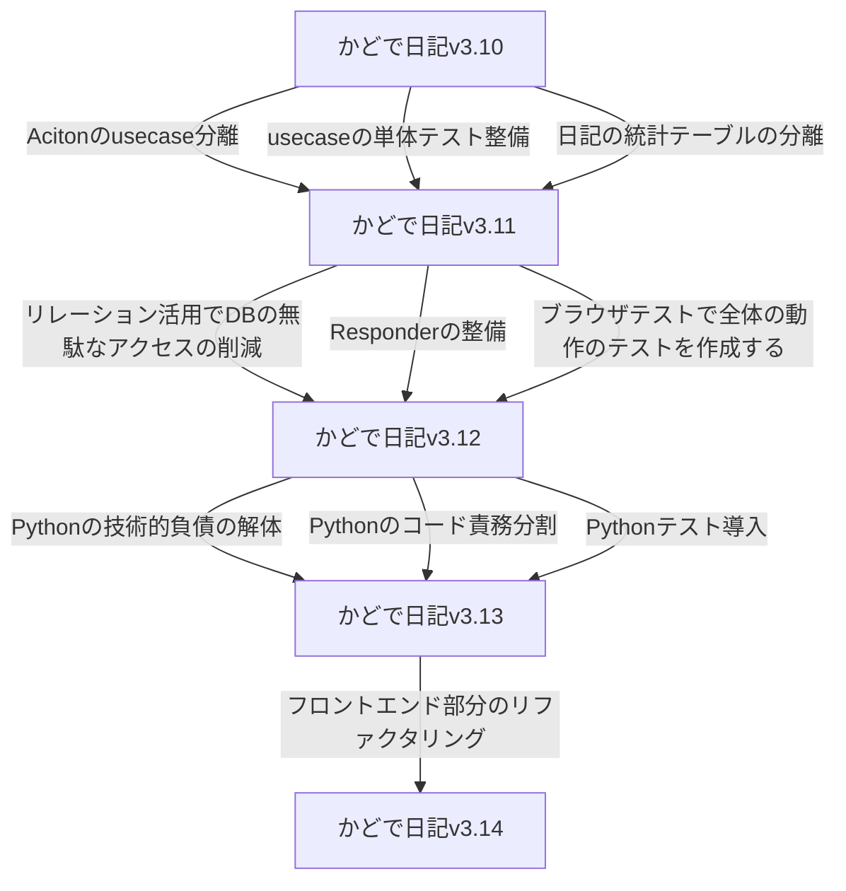

# この web アプリについて

個人的に欲しかった統計付き日記管理 web アプリを作っています。

https://kadode.usuyuki.net

## 開発者向け情報

https://kadodedocs.usuyuki.net

または docs ディレクトリへ

# Operation

## CI

### テスト周り

[![PHPテスト[ブラウザ]](https://github.com/Usuyuki/kadode_nikki3/actions/workflows/BrowserTest.yml/badge.svg)](https://github.com/Usuyuki/kadode_nikki3/actions/workflows/BrowserTest.yml)
[![PHPテスト[結合]](https://github.com/Usuyuki/kadode_nikki3/actions/workflows/CombinedTest.yml/badge.svg)](https://github.com/Usuyuki/kadode_nikki3/actions/workflows/CombinedTest.yml)
[![PHPテスト[単体]](https://github.com/Usuyuki/kadode_nikki3/actions/workflows/unitTest.yml/badge.svg)](https://github.com/Usuyuki/kadode_nikki3/actions/workflows/unitTest.yml)

### コード解析

### デプロイ

### 他

## Website

# 開発おたより

**現在はかどで日記 v3 系「リファクタリングのフェーズ」です!**

## 大域ロードマップ

[大域ロードマップ](ROADMAP/overall.md)

※かどで日記 3 内でのバージョン。かどで日記、かどで日記 2 とは異なる
[v3 系ロードマップ(完了部分)](ROADMAP/v3.md)

## v3 系未リファクタリング

※「ブラウザテストで全体の動作のテストを作成する」は出先で Docker を構築して盛大に壊れたので一旦保留。ブラウザテスト環境を Docker で作る難易度が想像以上に高かった

# 文章周り

## 開発者向けの情報は、かどで日記 wiki を御覧ください

[かどで日記 wiki](https://kadodedocs.usuyuki.net/)

## **ライセンス**

### かどで日記ライセンス

[LICENSE](./LICENSE.md)

    Copyright (c) 2021-2022 usuyuki

    Released under the MIT license

## 他

[プライバシーポリシー](https://kadode.usuyuki.net/privacyPolicy)

[利用規約](https://kadode.usuyuki.net/terms)

[このサイトについて](https://kadode.usuyuki.net/aboutThisSite)

[お問い合わせ](https://kadode.usuyuki.net/contact)

[お知らせ](https://kadode.usuyuki.net/osirase)

[リリースノート](https://kadode.usuyuki.net/releaseNote)

