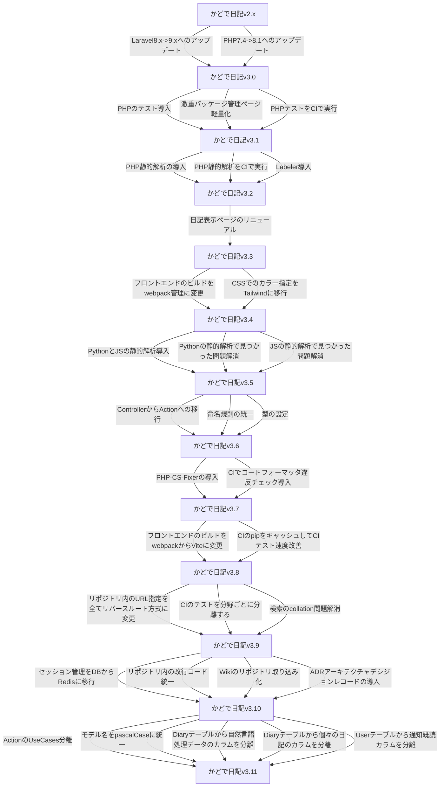

```mermaid
flowchart TD
    0[かどで日記v2.x]-->|Laravel8.x->9.xへのアップデート|1[かどで日記v3.0]
    0-->|PHP7.4->8.1へのアップデート|1
    1-->|PHPのテスト導入|2[かどで日記v3.1]
    1-->|激重パッケージ管理ページ軽量化|2
    1-->|PHPテストをCIで実行|2
    2-->|PHP静的解析の導入|3[かどで日記v3.2]
    2-->|PHP静的解析をCIで実行|3
    2-->|Labeler導入|3
    3-->|日記表示ページのリニューアル|4[かどで日記v3.3]
    4-->|フロントエンドのビルドをwebpack管理に変更|5[かどで日記v3.4]
    4-->|CSSでのカラー指定をTailwindに移行|5
    5-->|PythonとJSの静的解析導入|A[かどで日記v3.5]
    5-->|Pythonの静的解析で見つかった問題解消|A
    5-->|JSの静的解析で見つかった問題解消|A
    A-->|ControllerからActionへの移行|B[かどで日記v3.6]
    A-->|命名規則の統一|B
    A-->|型の設定|B
    B-->|PHP-CS-Fixerの導入|C[かどで日記v3.7]
    B-->|CIでコードフォーマッタ違反チェック導入|C
    C-->|フロントエンドのビルドをwebpackからViteに変更|D[かどで日記v3.8]
    C-->|CIのpipをキャッシュしてCIテスト速度改善|D
    D-->|リポジトリ内のURL指定を全てリバースルート方式に変更|E[かどで日記v3.9]
    D-->|CIのテストを分野ごとに分離する|E
    D-->|検索のcollation問題解消|E
    E[かどで日記v3.9]-->|セッション管理をDBからRedisに移行|E_F[かどで日記v3.10]
    E-->|リポジトリ内の改行コード統一|E_F
    E-->|Wikiのリポジトリ取り込み化|E_F
    E-->|ADRアーキテクチャデシジョンレコードの導入|E_F
    E_F[かどで日記v3.10]-->|ActionのUseCases分離|E_FF[かどで日記v3.11]
    E_F-->|モデル名をpascalCaseに統一|E_FF
    E_F-->|Diaryテーブルから自然言語処理データのカラムを分離|E_FF
    E_F-->|Diaryテーブルから個々の日記のカラムを分離|E_FF
    E_F-->|Userテーブルから通知既読カラムを分離|E_FF
```
